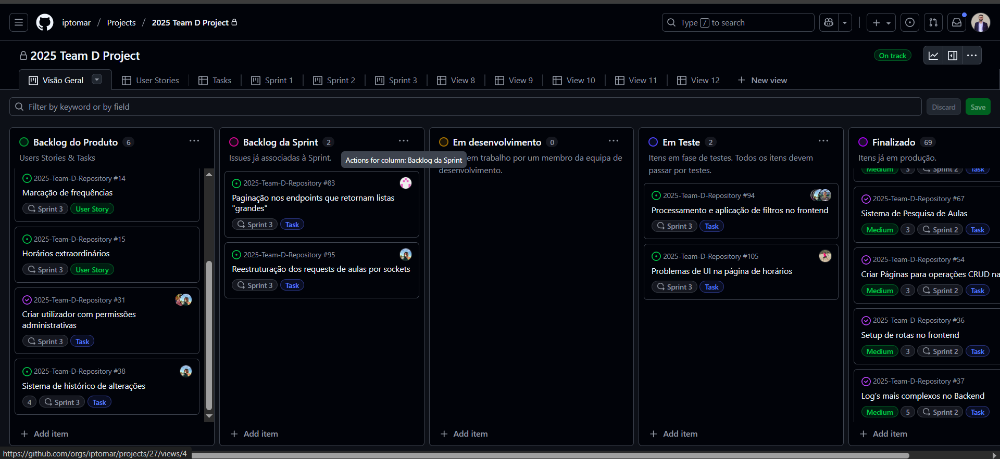
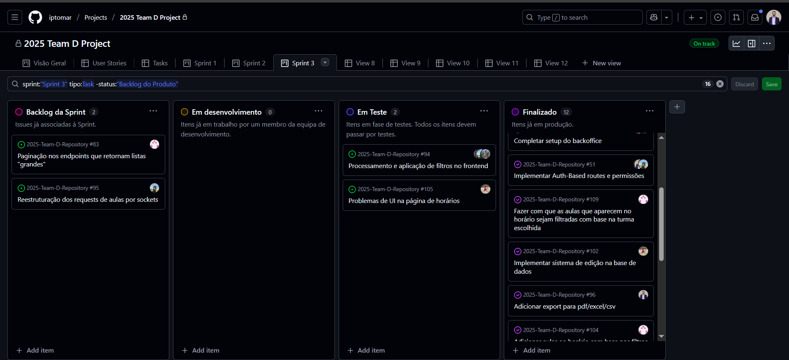
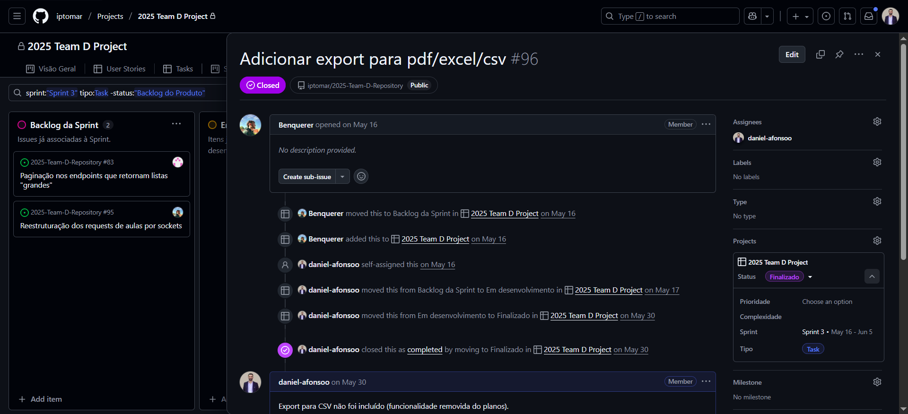
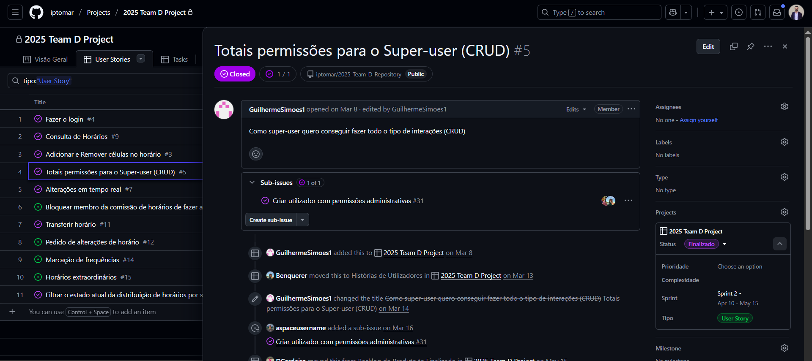
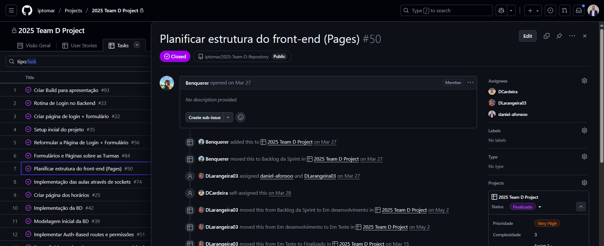

# Projeto Scrum em Desenvolvimento Web

Este repositório contém evidências (prints) da aplicação da metodologia **Scrum** num projeto académico de desenvolvimento web (React & Node.js).

## O que foi feito
- Definição de **user stories** e criação de backlog de produto.
- Planeamento de **sprints** e organização de backlog de sprint.
- Acompanhamento de **tasks** em boards Kanban no GitHub Projects (desenvolvimento, testes, finalização).
- Colaboração em equipa para execução e revisão de sprints.

## Prints

- Esta print fornece a **visão global** do projeto.
*******************************

- Esta print fornece a visão para o **Backlog da Sprint**, onde estão visíveis os estados em que se encontram as **tasks** planeadas para a respetiva **sprint**.
************************

- Exemplo de uma task completa, com histórico de alterações, responsáveis e evolução até à finalização. Mostra a rastreabilidade e acompanhamento do progresso
*******************************

- Exemplo de uma **user story** no **GitHub Projects**. Explica uma funcionalidade do ponto de vista do utilizador final e serve de base para a criação de tasks
*******************************

- Exemplo de uma **task** no **GitHub Projects**, com histórico de atribuições, alterações de estado (Backlog → Em desenvolvimento → Em Teste → Finalizado) e responsáveis. Demonstra como o progresso foi acompanhado de forma colaborativa até à conclusão.
